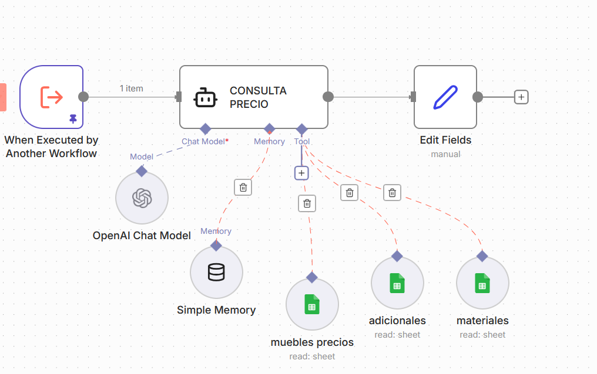

Por enquanto, a única melhorias que gostaria de implementar nesse workflow está relacionado a redução da margem de erro em ERRO NA APRESENTAÇÃO DE PREÇO DE MOVEIS ESPECÍFICOS [05 - erros e solucoes](05-erros-e-solucoes.md) 
Por vezes, o Agente Consulta Precios erra na resposta sobre preços de alguns móveis. Ocorre em uma média de uma vez a cada dez.

Acredito que o problema está no output do Agente. Quando o banco de dados está como uma tool do Agente, a consulta na tool é parte do output, que pode ocorrer erros.

# Ideia da melhoria

Transformar as tabelas não em tools, mas em inputs diretos em nodes previos, enviados ao agente antes da pergunta.

Assim, o agente recebe:

O pedido do usuário (tipos de móveis a orçar).

As tabelas completas, já carregadas em nodes anteriores.

Ou seja:
O agente não “consulta uma tool”.
 Ele simplesmente lê dados já disponíveis no input.
 Isso reduz drasticamente a chance de erro.

# Analogia simples

É como mandar para o ChatGPT:

“Aqui está um texto sobre padarias. Mostre todas as frases que contêm as palavras pão e bolo.”

 {texto}

O modelo recebe:
Um único prompt
Um único bloco de contexto com o texto

E responde baseado apenas nisso

Nesse caso, o Agente receberá:

“Aqui estão os móveis que o usuário quer orçar {informações}”

“E aqui estão as tabelas para consultar {Sheet1, Sheet2, Sheet3}”

Tudo junto em um único input consolidado, sem tool calls.

